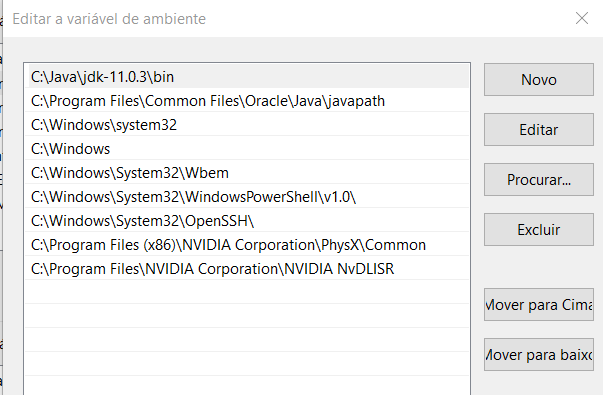

##  Intalando R, RStudio e Rtools no Windows

- Download and Install R: https://cran.r-project.org/
- Download and Install RStudio: https://rstudio.com/products/rstudio/download/#download

:star: Procurar não instalar diretório com espaço no nome. Levando em consideração a organização, instalar direto na raiz C:\  
:star: Procurar instalar softwares em Inglês para evitar possíveis camadas extras de bugs 

##  Como preparar um Ambiente Virtual para Desenvolvimento em Data Science
- Caso queira experimentar o Linux em um ambiente Windows, uma possibilidade é instalar uma máquina virtual 

##  Variáveis de Ambiente: Edição
- As variáveis de ambiente permite que sistema operacional saiba onde estão localizados os executáveis dos programas instalados.
- Quando o programa não inserir automaticamente o caminho do executável, tem-se que inserir manualmente.
- A variável PATH indica onde estão os executáveis.

Para criar uma variável de ambiente, deve-se abrir a caixa de Variáveis de Ambiente:

 
 
## JDK
JAVA_HOME = C:\Java\jdk-11.0.3  
PATH = C:\Java\jdk-11.0.3\bin   
- Ao inserir o PATH, a variável java tem q ser posicionada no topo da lista  

## Spark
SPARK_HOME = C:\spark   
PATH = C:\spark\bin   
PYSPARK_DRIVER_PYTHON = jupyter  
PYSPARK_DRIVER_PYTHON_OPTS = notebook   
PYSPARK_PYTHON = python3   

## Wintools 64 bits:(ferramenta que fornece privilégios em uma pasta)
https://github.com/steveloughran/winutils/tree/master/hadoop-2.7.1/bin 

## Wintools 32 bits:
https://drive.google.com/file/d/0B4PlPwU6yGTNT2FBdl9nTGNGOFk/view 

## Permissão
Crie o diretório C:\tmp\hive 
Abra o prompt e digite: C:\Hadoop\bin\winutils.exe chmod -R 777 C:\tmp\hive 

## Abrir o Spark no Windowns
Abrir um prompt de comando e digitar: spark-shell

## MongoDb
- Verificar em serviços se o MongoDb está inicializado
- Para iniciar, ir até a pasta bin do mongo. Nesse diretório, digitar mongo

## Conexão Spark + Mongodb
- Verificar se o pyspark está inicializando. Basta digitar pyspark no prompt de comando
- Abrir um prompt de comando e digitar: pyspark --packages org.mongodb.spark:mongo-spark-connector_2.12:2.4.0

# Troobleshooting
- Para iniciar o hdfs usar o comando: start-dfs.sh 
- Para finalizar o hdfs usar o comando: stop-dfs.sh 
Para verificar arquivos de logs usar o comando cd /opt/hadoop/logs/ 
Para limpar todos os arquivos em um diretório usar o comando rm -rf *
Se a VM não funcionar, pode-se formatar o hdfds(isso exclui todos os arquivos): hdfs namenode -format
Caso o problema persista, exclua o conteúdo da pasta hadoop-hadoop no diretório tmp (use cd /tmp/ para ir ao tmp)

- Caso queira experimentar o Linux em um ambiente Windows, uma possibilidade é instalar uma máquina virtual 

