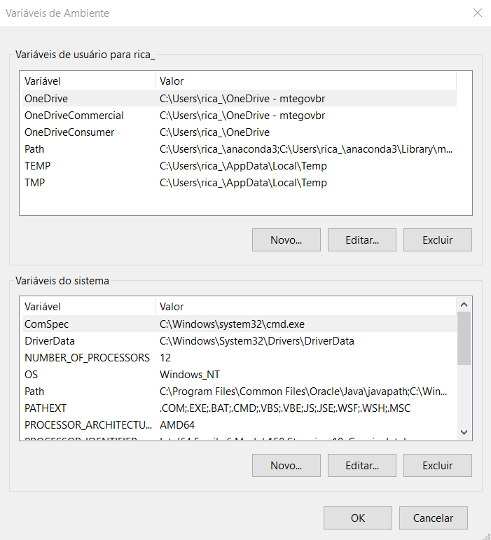
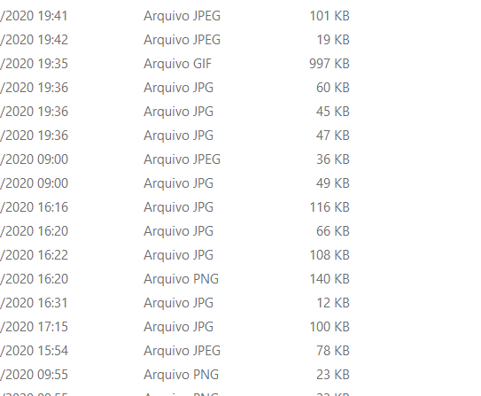

##  Intalando R, RStudio e Rtools no Windows

- Download and Install R: https://cran.r-project.org/
- Download and Install RStudio: https://rstudio.com/products/rstudio/download/#download

:star: Procurar não instalar diretório com espaço no nome. Levando em consideração a organização, instalar direto na raiz C:\  
:star: Procurar instalar softwares em Inglês para evitar possíveis camadas extras de bugs 

##  Como preparar um Ambiente Virtual para Desenvolvimento em Data Science
- Caso queira experimentar o Linux em um ambiente Windows, uma possibilidade é instalar uma máquina virtual 

##  Variáveis de Ambiente: Edição
- As variáveis de ambiente permite que sistema operacional saiba onde estão localizados os executáveis dos programas instalados.
- Quando o programa não inserir automaticamente o caminho do executável, tem-se que inserir manualmente.

Para criar uma variável de ambiente, deve-se abrir a caixa de Variáveis de Ambiente:
"}

 
 
## JDK
JAVA_HOME = C:\Java\jdk-11.0.3
PATH = C:\Java\jdk-11.0.3\bin

## Spark
SPARK_HOME = C:\spark
PATH = C:\spark\bin
PYSPARK_DRIVER_PYTHON = jupyter
PYSPARK_DRIVER_PYTHON_OPTS = notebook
PYSPARK_PYTHON = python3

## Wintools 64 bits:
https://github.com/steveloughran/winutils/tree/master/hadoop-2.7.1/bin

## Wintools 32 bits:
https://drive.google.com/file/d/0B4PlPwU6yGTNT2FBdl9nTGNGOFk/view

## Permissão
Crie o diretório C:\tmp\hive
Abra o prompt e digite: C:\Hadoop\bin\winutils.exe chmod -R 777 C:\tmp\hive

- Caso queira experimentar o Linux em um ambiente Windows, uma possibilidade é instalar uma máquina virtual 

https://prnt.sc/vwe0wt

